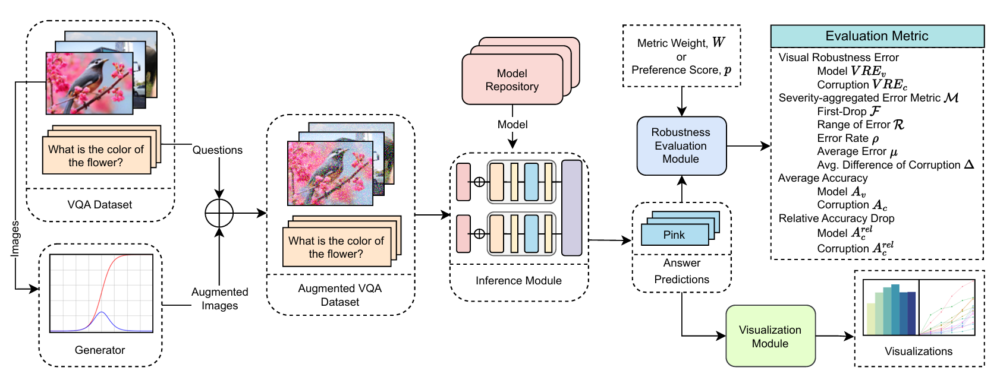

# Visual Robustness Benchmark for Visual Question Answering (VQA)

**Paper**: [ArXiv](https://arxiv.org/abs/2407.03386)

[Md Farhan Ishmam*](https://cse.iutoic-dhaka.edu/profile/farhanishmam/), [Ishmam Tashdeed*](https://cse.iutoic-dhaka.edu/profile/ishmamtashdeed/), [Talukder Asir Saadat*](https://www.bubt.edu.bd/department/member_details/806), [Md. Hamjajul Ashmafee](https://cse.iutoic-dhaka.edu/profile/ashmafee/), [Md. Azam Hossain](https://cse.iutoic-dhaka.edu/profile/azam/), and [Abu Raihan Mostofa Kamal](https://cse.iutoic-dhaka.edu/profile/raihan-kamal/) (*Equal Contribution)

## Overview of the Visual Robustness Benchmark



## Quick Start
A helpful <a href='https://colab.research.google.com/drive/1gTsUG5BNp3MPyQQS8L6qpBqpZD45E3Vp?usp=sharing'>Notebook</a> is given to run basic commands. 

**Note:** Make sure that you already have the `Image directory`, `question JSON`, and `annotation JSON` in your drive.

## Installation

### Step 1:
If you have CUDA support then install `torch`, `torchvision`, and `torchaudio` as:
```
pip install torch torchvision torchaudio --extra-index-url https://download.pytorch.org/whl/[CUDA_VERSION]
```
For details, go to: <a href="https://pytorch.org/get-started/locally/">PyTorch</a> website.

If you don't have CUDA support then install `torch`, `torchvision` and `torchaudio` as:
```
pip install torch torchvision torchaudio
```

### Step 2:
Install `requirements.txt` file running the command:
```
pip install -r requirements.txt
```

### Step 3:
Install MagickWand library. If you have a *Linux* system use:
```
sudo apt-get install libmagickwand-dev
```
If you have a *Windows* system, follow steps given in the <a href='https://docs.wand-py.org/en/latest/guide/install.html#install-imagemagick-on-windows:~:text=/opt/local-,Install%20ImageMagick%20on%20Windows,-%C2%B6'>website</a>.

## Data Analysis

Data analysis for this work is done in Python via the given notebooks. All the plots included in the paper can be reproduced via the notebooks.

## Acknowledgement

We thank the Network and Data Analysis Group (NDAG), IUT-CSE for providing the computational resources to conduct the experiments.

## Citation
```
@article{ishmam2024visual,
  title={Visual Robustness Benchmark for Visual Question Answering (VQA)},
  author={Ishmam, Md Farhan and Tashdeed, Ishmam and Saadat, Talukder Asir and Ashmafee, Md Hamjajul and Kamal, Dr Abu Raihan Mostofa and Hossain, Dr Md Azam},
  journal={arXiv preprint arXiv:2407.03386},
  year={2024}
}
```
