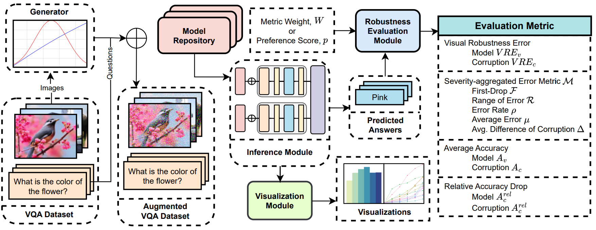
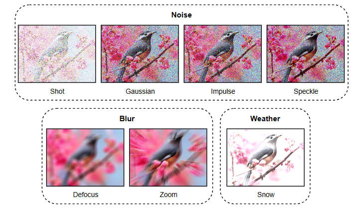
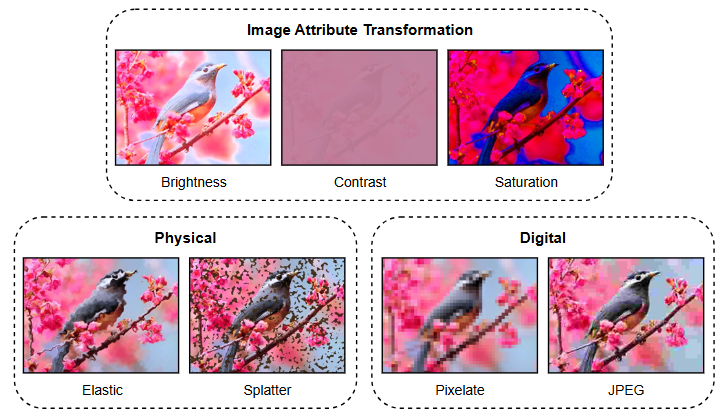

<div align="center">

# Visual Robustness Benchmark for Visual Question Answering (VQA)

</div>

<p align="center">
  <a href="https://farhanishmam.github.io/"><strong>Md Farhan Ishmam*</strong></a>
    ·
    <a href="https://ishmamt.github.io/"><strong>Ishmam Tashdeed*</strong></a>
    ·
    <a href="https://www.bubt.edu.bd/department/member_details/806"><strong>Talukder Asir Saadat*</strong></a>
      ·
     <a href="https://cse.iutoic-dhaka.edu/profile/ashmafee/"><strong>Md. Hamjajul Ashmafee</strong></a>
    ·
    <a href="https://cse.iutoic-dhaka.edu/profile/azam/"><strong>Md. Azam Hossain</strong></a>
    ·
    <a href="https://cse.iutoic-dhaka.edu/profile/raihan-kamal/"><strong>Abu Raihan Mostofa Kamal</strong></a>
</p>

<div align="center">

[](https://arxiv.org/abs/2407.03386)

[](https://github.com/ishmamt/VQA-Visual-Robustness-Benchmark/)
</div>

---

<p style="text-align: justify;">
We introduce a large-scale benchmark with 213,000 augmented images to challenge the visual robustness of VQA models against realistic visual corruptions. We also design novel robustness evaluation metrics that can be aggregated into a unified metric, adaptable for multiple use cases. Our experiments reveal key insights into the interplay between model size, performance, and robustness, emphasizing the need for model development without sacrificing robustness for performance.
</p>

## Overview of the Visual Robustness Benchmark



The architecture of the Visual Robustness Framework and its components – 
- **Model Repository:** Hosts multiple VQA models for inference
- **Generator:** Applies the corruption functions to the VQA dataset and generates multiple augmented datasets
- **Inference Module:** Inferences on the augmented datasets using models from the model repository
- **Robustness Evaluation Module:** Evaluates the results of the inference module by computing robustness metrics
- **Visualization Module:** Produces visualizations based on the predicted answers.

The VQA datasets, models, and corruptions are the input to the framework while the VRE scores, accuracy scores, and visualizations will be produced as the output.

## Visual Corruption Functions
We introduce 14 corruption functions categorized into 6 classes and replicating realistic visual effects.
<p align="center">
  
  
</p>

## Robustness Evaluation Metrics
| Metric Name      |Symbol|Formula|
|------------------|----------------|----------------------------------------------|
| First-Drop         |  $F_{v,c}$ | $\frac{E_{v,c,1} - E_{v,c,0}}{E_{v,c,0}}$   |
| Range of Error         | $\mathcal{R}_{v,c}$ | $\frac{\underset{l\in\mathbb{L}}{max\ }E_{v,c,l} - \underset{l\in\mathbb{L}}{min\ }E_{v,c,l}}{\underset{l\in\mathbb{L}}{min\ }E_{v,c,l}}$                            |
| Error Rate   | $\rho_{v,c}$ | $\frac{L\underset{l\in \mathbb{L}}{\sum}\left(l\cdot E_{v,c,l}\right)-\left(\underset{l\in \mathbb{L}}{\sum}l\right)\cdot \left(\underset{l\in \mathbb{L}}{\sum}E_{v,c,l}\right)}{L\underset{l\in \mathbb{L}}{\sum}l^2 - \left(\underset{l\in \mathbb{L}}{\sum}l\right)^2}$ |
| Average Error | $\mu_{v,c}$ | $\frac{1}{L}\underset{l\in \mathbb{L}}{\sum}E_{v,c,l}$                                  |
|  Average Difference of Corruption Error| $\Delta_{v,c}$ | $\frac{1}{L}\underset{l\in \mathbb{L}'}{\sum}\left(E_{v,c,l}-E_{v,c,0}\right)$ |
| Visual Robustness Error | $VRE_{v/c}$ | $\underset{\mathcal{M}\in \mathbb{M}}{\sum}W_\mathcal{M}\mathcal{M}_{v/c}$ |


## Quick Start

[](https://colab.research.google.com/drive/1gTsUG5BNp3MPyQQS8L6qpBqpZD45E3Vp?usp=sharing)

⚠️ Ensure that you have the `Image directory`, `question JSON`, and `annotation JSON` data in your drive. ⚠️

## Installation

This repository is tested on `Python 3.8`. Create a virtual environment to install all the dependencies.

1. To install `torch` visit the <a href="https://pytorch.org/get-started/locally/">PyTorch</a> website and follow the instructions.
2. Install `requirements.txt` file running the command:
   
      ```
      pip install -r requirements.txt
      ```
      
3. Install `MagickWand` library. If you have a **Linux** system use:
   ```
   sudo apt-get install libmagickwand-dev
   ```

If you have a **Windows** system, follow steps given in the <a href='https://docs.wand-py.org/en/latest/guide/install.html#install-imagemagick-on-windows:~:text=/opt/local-,Install%20ImageMagick%20on%20Windows,-%C2%B6'>website</a>.

## Dataset

This repository uses a random split of the VQAv2 dataset found on the <a href="https://visualqa.org/download.html">Visual Question Answering</a> website.

## Experiment

To run the experiment, execute the following command:
```
python main.py
```

## Data Analysis

Data analysis for this work is done in Python via the given notebooks. All the plots included in the paper can be reproduced via the notebooks.

## Acknowledgement

Some of the visual corruption functions of this repository have been taken from <a href="https://github.com/hendrycks/robustness">ImageNet-C</a>.

## Citation
```
@article{ishmam2024visual,
  title={Visual Robustness Benchmark for Visual Question Answering (VQA)},
  author={Ishmam, Md Farhan and Tashdeed, Ishmam and Saadat, Talukder Asir and Ashmafee, Md Hamjajul and Kamal, Dr Abu Raihan Mostofa and Hossain, Dr Md Azam},
  journal={arXiv preprint arXiv:2407.03386},
  year={2024}
}
```
